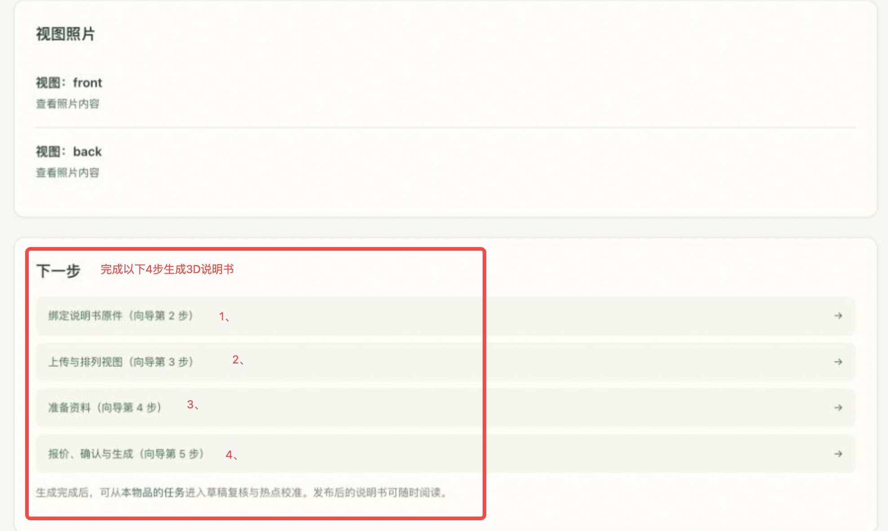
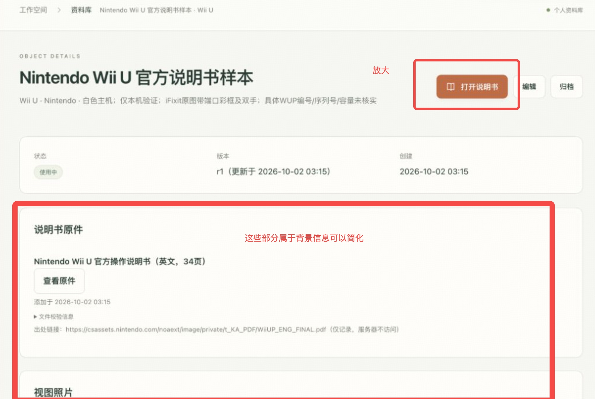
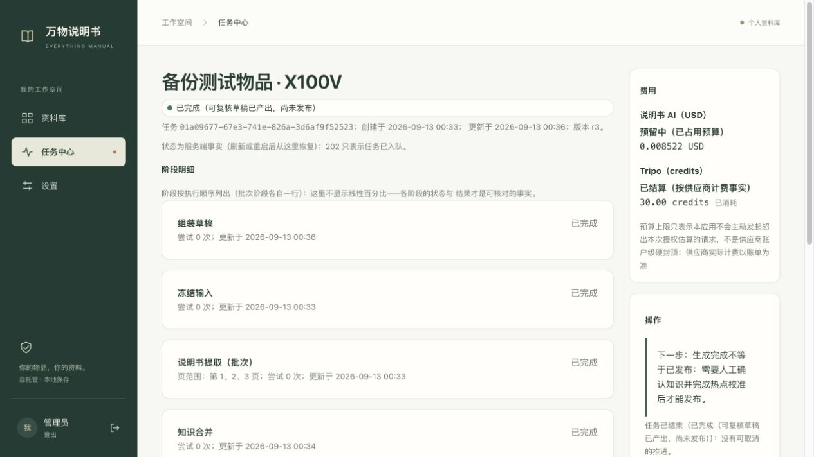
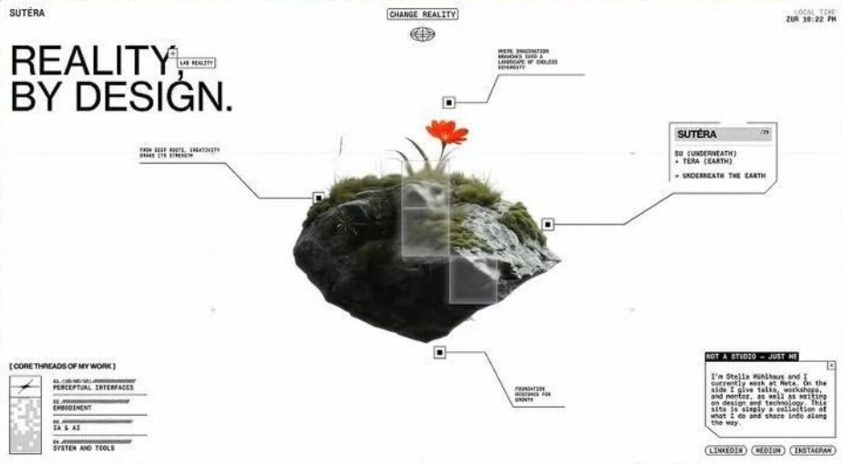
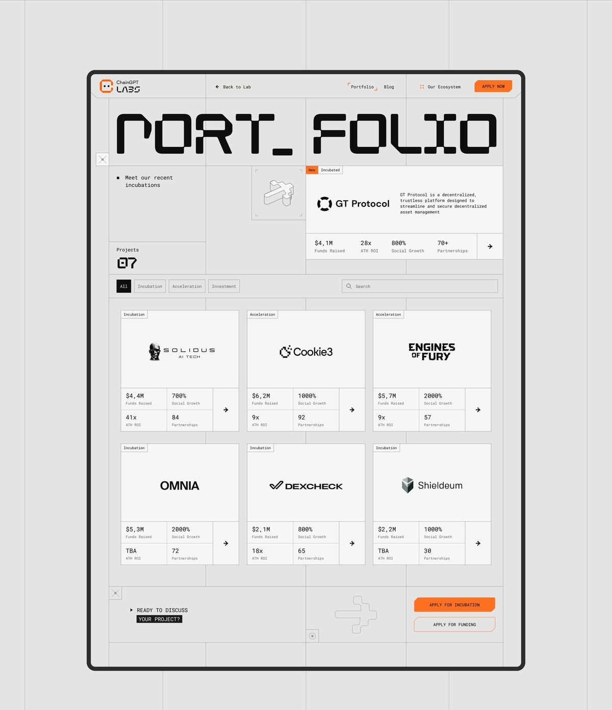
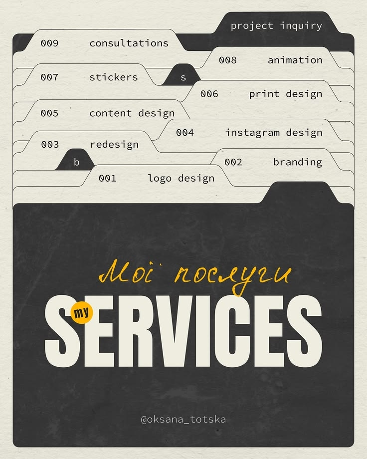

# UI改稿反馈

**现阶段最需要优先解决的几个问题：**

> **① 流程是否足够简单**
> **② 页面主次是否足够明确**
> **③ 用户能不能一眼知道下一步做什么**
> **④ 3D生成和按键识别是否真的能稳定完成**
> 
> 

### 一、流程感受

理解目前的核心流程是：

1. **登录**

2. **查找说明书**

    - 查看需要的说明书是否已经在库中

    - 如果没有，需要用户自己建立档案并上传说明书

3. **上传产品四视图**

    - 找到对应说明书后，上传手中产品的四视图

4. **Tripo 生成 3D**

    - 将产品生成 3D，并结合说明书生成带有 **3D 标注/交互说明** 的版本

目前第 4 步还没有看到对应的 UI 截图，所以这部分暂时无法判断最终的体验。

### 二、首要修改方向：调整的是信息层级和操作引导

1. 建议在进入正式流程前，先增加一个**极简的使用说明/流程引导**，让用户先快速理解整个产品是怎么工作的，以及最终能够得到什么。

比如

> **① 找到说明书 → ② 识别你的相机 → ③ 生成3D说明书**
> 
> 

让用户先建立一个完整的流程认知，再进入具体操作。

2. 进入具体页面后，再保持**一个页面只完成一个核心任务**：

- 查找说明书 → 重点引导「搜索/选择说明书」

- 找到说明书 → 引导「上传/确认产品」

- 产品确认 → 引导「生成3D」

- 最终 → 查看带3D标注的说明书

需要让用户始终知道：

> **我现在在做什么 → 为什么要做 → 做完之后会发生什么**
> 
> 

例子：

3. **设置/配置部分目前感觉稍微有点复杂**。像 API、模型参数等内容，对于普通的相机爱好者来说可能不是他们真正关心的，可以考虑弱化或者隐藏到「高级设置」里。

默认情况下尽量让用户只看到和「使用说明书」相关的核心功能，把技术配置留给有需要的高级用户。这样整体会更像一个面向普通用户的产品，而不是一个 AI 技术 Demo。

### 三、视觉风格：可以降低一点「AI产品感」

这个产品其实可以尝试往更有「说明书」属性的方向走，比如：

- **极简**

- **复古未来**

- **工业设计**

- **网格系统**

- **技术说明书 / 工程图纸**

可以参考一些老式电子产品说明书、工业手册、维修手册的视觉语言，在此基础上加入一点未来感。

这样可能会比现在比较常见的 AI 渐变、卡片、发光等元素更有产品辨识度，也更贴合「万能说明书」这个概念。

### 四、说明书库：Demo阶段可以先丰富起来

如果目前库里的说明书比较少，我建议可以先把我们手头现有的说明书尽可能传进去，让 Demo 本身看起来是一个 **已经有内容积累的产品**。

### 五、先预制一定数量的3D说明书，减少用户操作

> 现阶段有一个比较关键的问题：
> 
> **Tripo 生成 3D 后，能不能稳定、准确地识别并标注产品上的每一个按键/部件？**
> 
> 
> 
> 按照现在的流程，如果库里没有对应说明书，用户需要同时拥有：
> 
> **说明书 \+ 产品实物 \+ 产品四视图**
> 
> 才能最终生成 3D 说明书。
> 
> 这其实对用户来说是一个比较重的前置条件。
> 
> 反过来，如果产品本身能够通过 **搜索说明书/产品型号** 就解决大部分问题，那么用户为什么还需要一定要走「上传四视图 → 生成 3D」这条复杂流程？
> 
> 所以我觉得这里可以进一步考虑：
> 
> **是否可以把「3D生成」从必经流程，变成一种预设好的体验**
> 
> 

Demo 阶段可以考虑**提前预制一批常见相机的 3D 说明书**，让用户进入后可以直接搜索、选择并体验完整的 3D 说明书。

这样可以减少用户需要自己上传「说明书 \+ 产品四视图」等一系列前置操作，让用户更快体验到产品真正的核心功能。

同时也可以通过预制内容，把 Demo 的重点从：

> **「我要怎么上传、怎么生成」**
> 
> 

转向：

> **「原来普通说明书可以直接变成这样的 3D 说明书」**
> 
> 

用户体验完整功能之后，如果希望使用库里没有的产品，再引导其自行上传和生成。

### 六、社区/激励机制可以作为后续方向

如果未来需要不断丰富说明书库，可以进一步考虑把「上传说明书」变成一种社区贡献行为。

例如：

- 用户上传说明书

- 其他用户可以查看、评论、补充

- 上传 / 查看 / 使用可以获得成就

- 建立「贡献者」体系

- 根据贡献度解锁一些身份或权益

这样说明书库可以从一个单纯的数据库，逐渐变成一个 **由用户共同维护的产品资料库**。

不过我觉得这些属于后续阶段。

