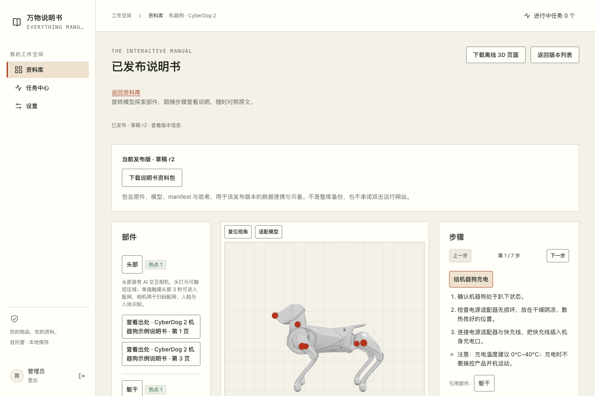
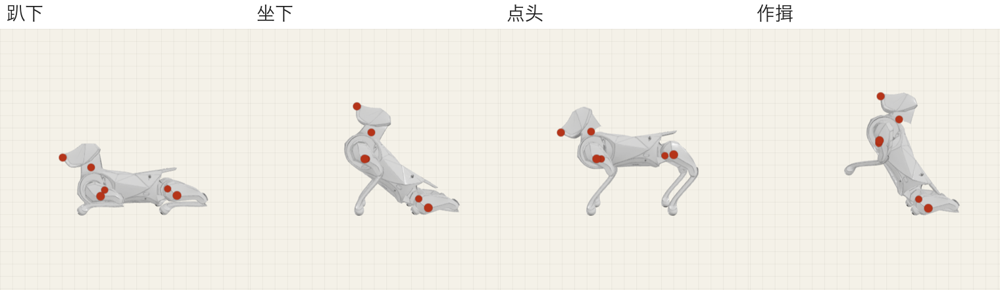
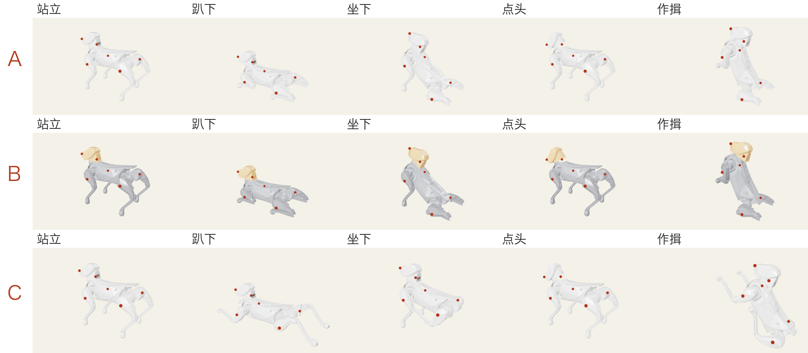

# 内置示例：机器狗（CyberDog 2）

`everything-manual init` 在**空资料库**中写入这份已发布的示例说明书，首次登录即可在资料库「阅读说明书」。
重复 `init` 不会重复写入；`init --no-sample` 跳过（测试与需要空库的部署使用）。实现见
`crates/server/src/config/sample.rs`，资产在编译期嵌入二进制。

| 内容 | 说明 |
|---|---|
| 部件（6） | 头部、躯干、左前腿、右前腿、左后腿、右后腿；每个部件 1 个已确认热点 |
| 姿势（5） | 站立、趴下、坐下、点头、作揖（膝关节分两段，见下） |
| 步骤（7）/ 规格（8） | 充电、摆放、开关机、配网、语音互动、使用前检查、作揖；续航、充电温度、唤醒词等 |
| 原文 | `manual.pdf`：4 页示例说明书，所有条目的出处页码指向它 |

## 资产来源

- `model.glb`：由一次真实的 Tripo 多视图生成结果（CyberDog 2 说明书插图 → 3D）手工整理：去除漂浮碎片；
  右前腿缺下半段，用左前腿镜像补齐；按几何规则切成头、躯干与四条腿，每条腿再在膝部分为大腿/小腿两段
  （共 10 个节点，节点名即中文部件名）。姿势按真实关节轴设计（髋、膝、颈，绕身体侧轴旋转），并自动贴地。
- `knowledge.json` / `review.json`：示例知识与复核覆盖层，依据 CyberDog 2 公开产品说明书整理；
  `{{DOC}}` 等占位符在写入时替换为真实 ID 与哈希。
- `manual.pdf`：为示例重新排版的 4 页说明书（非官方文档），封面图为该 3D 模型的渲染。

## 候选与选择

做了三个候选，用户选择 A（原色、带膝关节）：

- **A（采用）**：原模型配色；腿分大腿/小腿，趴下时小腿收起、坐下前腿撑地、作揖前爪胸前合拢。
- **B**：同 A 的动作，按部件着色（头部暖橙、躯干中灰、四肢深灰）。
- **C**：严格 6 个几何分件，腿整根转动，不能弯膝，动作较僵硬。
