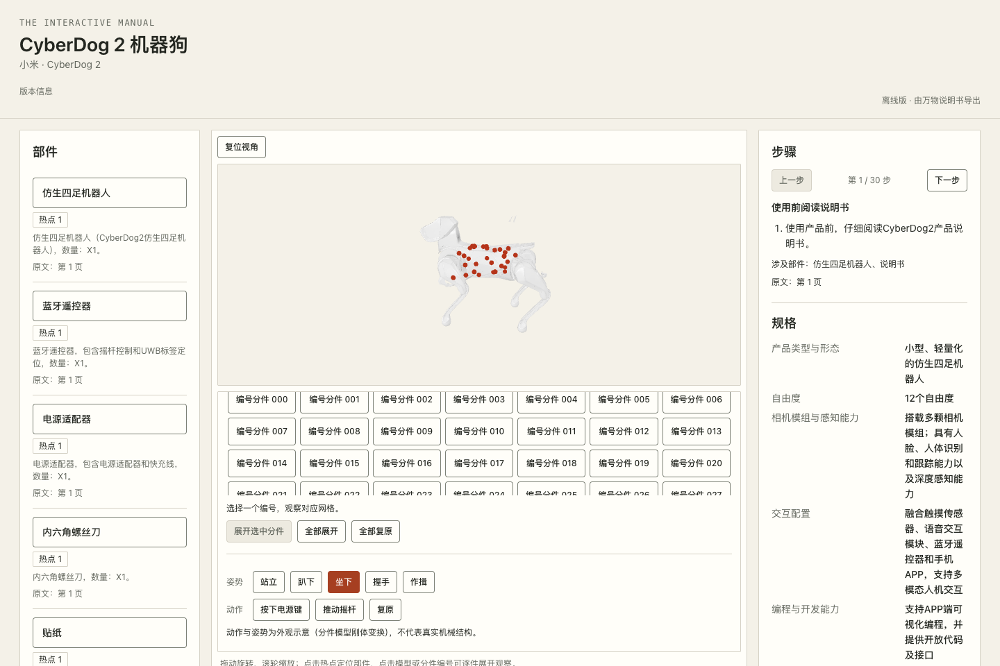
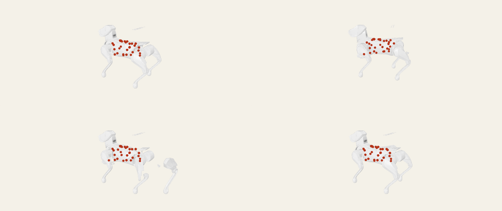

# 演示：CyberDog 2 机器狗 3D 交互说明书

**双击 [`cyberdog2-3d.html`](cyberdog2-3d.html) 即可打开**，不需要安装、登录或联网（单文件，约 12 MB；Chrome / Edge / Safari 均可）。

它由万物说明书根据小米 CyberDog 2 的产品说明书 PDF（23 页）自动生成，经人工复核后发布，再用阅读器的「下载离线 3D 页面」导出。

## 可以试的交互

- **旋转 / 缩放模型**：拖动旋转，滚轮缩放，「复位视角」回到初始角度；
- **部件**：左侧 32 个带热点的部件（电源键、摇杆、足垫、AI 交互相机……），点击定位到模型热点，并显示说明书原文页码；
- **姿势**：站立 / 趴下 / 坐下 / 握手 / 作揖（基于 Tripo 分件模型的刚体动画）；
- **动作**：按下电源键、推动摇杆；
- **编号分件**：逐个选中 Tripo 分出的几何分件，可展开 / 复原观察；
- **步骤**：右侧 30 个使用步骤可逐步翻看，每步注明原文页码与涉及部件；下方为规格表。

## 生成过程

| 环节 | 内容 |
|---|---|
| 输入 | CyberDog 2 产品说明书 PDF；视图由系统从 PDF 插图自动提取并分类（正面 / 左侧 / 背面 / 特写） |
| 3D 模型 | Tripo 多视图生成（`tripo-h-v3.1-standard`），再用 Tripo `mesh/segment` v2 分件 |
| 说明书知识 | 说明书 AI 逐批提取部件、步骤、规格（每条带原文页码） |
| 交互 | 自动热点绑定 + 由分件几何推导的姿势与动作 |
| 发布 | 复核页确认热点与文字事实后发布不可变版本；后台生成约 6 分钟 |

完整的界面操作流程（14 张截图）见 [`artifacts/user-walkthrough-cyberdog/`](../../artifacts/user-walkthrough-cyberdog/README.md)。在线阅读器截图：[`reader.png`](reader.png)。

## 说明

- 动作与姿势是**外观示意**（分件模型的刚体变换），不代表真实机械结构；热点位置为自动估算，仅供演示。
- 说明书内容与产品形象版权归原厂商（小米）所有，此处仅用于功能演示。
- 文件来源：发布版本 `01a105d4-b499-722c-b148-285e53685c3a`；`cyberdog2-3d.html` 的 SHA-256 为
  `9b2a9d2084a6b100f680d6c9af1166812047c1251180ea0b1abf9e88a5a9df30`。
