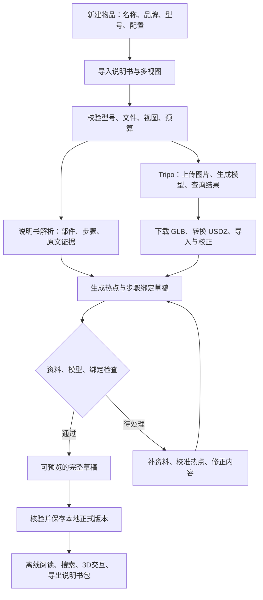

# 万物说明书：实施说明文档

> **已被替代（2026-09-11）**：用户已改为 React + Rust 网站、单二进制发布。当前实施请从 [llmdoc 总索引](../llmdoc/README.md) 和 [网站技术架构](../llmdoc/architecture.md) 开始。本文保留历史背景；其中 macOS／SwiftUI／USDZ 和恢复旧 Swift 源码的要求不再是当前任务。

版本：v0.1 · 编写日期：2026-09-11 · 状态：实施方案，尚未开始功能开发

目标平台：现有 macOS 应用；产品名称统一为「万物说明书」，内部暂用 `EverythingManual`。

## 1. 产品目标与实施结论

用户输入具体物品及型号，提供该型号的说明书和多视图照片，应用自动完成资料整理、说明书知识提取、Tripo 3D 生成、模型下载与导入、交互内容绑定，产出可在本地使用的 3D 交互说明书。

完整产品由三部分组成：

| 组成 | 负责解决的问题 | 主要产物 |
| --- | --- | --- |
| 物品知识 | 这是什么、部件叫什么、如何操作、依据在哪里 | 物品档案、部件、参数、操作步骤、原文引用 |
| 物品模型 | 外观是什么、从不同方向看是什么样 | 原始 GLB、运行用 USDZ、预览图、模型版本 |
| 交互绑定 | 点哪里看什么、当前步骤对应哪里 | 热点、部件映射、推荐视角、步骤与动作绑定 |

**首版实施目标：自动生成可查看、可校准的交互说明书草稿，并通过验收成为本地正式版本。** 正常资料可以连续完成整个自动流程；型号冲突、模型缺失关键结构、热点不确定等情况进入待处理列表。生成完成与内容已经核验是两个独立状态。

Tripo 负责几何和外观生成。说明书理解需要单独的文本／视觉模型服务，交互绑定需要本应用实现。外观相似、网格可分割，并不能证明真实的部件名称、装配关系、转轴和操作顺序。本方案据此安排首版范围和后续升级。

### 1.1 本方案采用的默认决策

- 首版为单用户、本地资料库，使用用户配置的服务凭据；无需自建服务器。
- 优先支持实物照片清晰、外部控制件可见的刚性物品，如相机、小家电、工具和仪器。
- 首版保留原型的 macOS 14 兼容目标和三栏阅读方式，渲染实现通过统一接口隔离。
- 新接入采用 Tripo v3 REST，默认 H 系列 `v3.1-20260211`；版本和价格表采用配置快照。
- 保存 Tripo 原始 GLB，另生成 USDZ 供原生应用运行；绑定建立在最终运行文件上。
- 首版交互以热点、聚焦、标注和步骤导航为主；精确拆解与机械运动另设验收阶段。
- 本文是项目文档交付；文中的接口示例尚未执行，不产生 Tripo 或其他 AI 服务费用。

## 2. 当前项目基线

本次检查发现，工作目录当前缺少 `Package.swift`、`Sources/`、`script/` 等源码和启动文件，保留 `.build/`、`.codex/`、`.git/` 与 `.gitignore`。Git 当前分支没有提交记录，因此不能假设通过普通 Git checkout 就能恢复源码。

上一轮实际打开过 `FilmCameraManual` 应用，界面包含物品／部件列表、蓝线 3D 场景、规格说明、资料来源和“使用照片生成 3D 模型”入口。本次构建缓存还记录了下列历史模块名；**这些只能证明原型结构，不能证明目前 API 请求、错误恢复或导入链路已完整实现。**

| 原型线索 | 在万物说明书中的用途 | 开发前需要确认 |
| --- | --- | --- |
| `ContentView`、`SidebarView`、`InspectorView` | 资料库与三栏说明书阅读器 | 恢复／重建可编译基线 |
| `ManualModels`、`ManualLibrary` | 通用说明书数据与索引 | 去除必须为每个型号写 Swift 数据的依赖 |
| `AI3DAPIClient`、`GeneratedModelStore` | Provider 接口和生成任务管理 | 真实 API 版本、持久化和失败语义 |
| `AIModelGeneratorView` | 新建物品向导与任务进度 | 增加说明书、多视图、预算、草稿结果 |
| `CameraSceneView`、`GeneratedModelSceneView` | 模型浏览与交互 | 导入格式、坐标、拾取、热点、资源释放 |
| `Bronica…Geometry`、`Nikon…Geometry` | 相机演示内容 | 转为样例包或兼容适配，不再作为新增物品的必经方式 |

P0 必须先取得可编译源码基线。若原源码无法恢复，就按本方案重建应用壳；本文后续模块名均为目标设计，不是已存在代码清单。编译缓存不能替代源码仓库。

## 3. 用户完整流程



### 3.1 新建物品

必填：物品名称、准确型号、至少一份说明书、至少一张可用正面照片。品牌、类别、型号别名、地区版本、尺寸和单位为补充信息；无品牌物品可显式标记“无品牌／未知”。

独立记录 `configuration`：例如机身、镜头、取景器、手柄和后背的组合，或设备是否装有某附件。相同型号的不同配置不能混用一套多视图。

标准多视图任务要求正面加至少另一侧照片；只有一张时显示为“单图生成”，需要用户选择该模式后再提交。只有文字名称、没有照片时允许先建立档案，不把概念生成结果标为该型号的准确模型。

### 3.2 导入资料

| 输入 | 首版处理 | 保存内容 |
| --- | --- | --- |
| PDF 说明书 | 读取文本；扫描页走 OCR；保留页图和排版位置 | 原文件、文件哈希、每页文本、页图、引用位置 |
| JPG／PNG 扫描说明书 | 按用户排序组成虚拟文档后 OCR | 原图、页序、文字框与识别质量 |
| 说明书 URL | 下载公开可获取的 PDF；记录原链接和获取时间 | 本地副本、来源、哈希；失败时仍可改用本地文件 |
| 多视图照片 | 自动建议视图标签，用户可调整 | 原图、处理后图片、视图标签、配置与来源 |
| 尺寸、补充说明 | 区分“用户填写”和“说明书记载” | 数值、单位、来源、待核验状态 |

首版不把任意网页爬取、登录站点抓取或视频转模型纳入输入承诺。照片支持导入 WebP／HEIC 等常见来源，但上传前统一转成 PNG／JPEG；保留原始文件。

### 3.3 启动与结果

启动页显示所选图片、发送给各服务的资料类别、预计费用、预算上限和本次生成配置。用户点击“一键生成说明书”后，自动执行该配置内的上传、生成、转换和解析，不逐步骤弹出确认。

进度按“解析资料／生成模型／导入／绑定／检查”分别展示。Tripo 的 100% 只表示对应远程任务完成，不代表整个说明书已经完成。资料解析失败时保留已生成模型；模型失败时保留已解析内容。

完成后自动打开草稿工作区。用户可以修正识别名称、点击模型放置热点、调整推荐视角、对照原文核验步骤，再保存一个不可变的正式版本。这里的“正式版本”指本地版本状态，不涉及公网发布。

## 4. 输入质量与自动化边界

标准视图标签为 `front / left / back / right`，方向以物品自身为参照；左右不是观察者面对物品时的左右。向导用示意轮廓解释方向。顶部、底部、三分之四角和局部特写可一并收录，用于理解、校验和后续定位，但不强塞进 Tripo 的四个方向槽位。

建议采集要求属于本产品的质量标准：同一物品、同一配置、同一开合状态；主体完整、无遮挡；背景简洁；长边建议 1024–2048 像素；关键控制件另提供特写。首版做方向纠正、缩放、裁剪和背景分离，保留孔洞、薄片、线缆和反光边缘供用户核对。

预检包含：文件可解码、重复照片、缺少正面、型号文字冲突、配置不一致、清晰度不足和主体裁切。确定性错误阻止提交；AI 判断的疑似问题显示具体证据。AI 补出的背面图必须标记为合成资料，不作为真实结构的证据。

初期自动化指标只衡量经过预检的样本集，不承诺任意物品、任意照片都能全自动准确完成。低质量输入仍可保存为档案或图文说明书。

## 5. 系统架构与技术选择

```text
SwiftUI 界面
  ├─ Library / CreationWizard / JobCenter
  ├─ ManualWorkspace / SourceViewer / AnnotationEditor
  └─ Settings
       ↓
应用服务：PipelineCoordinator / LibraryRepository / RevisionService
       ↓
领域数据：Item / Source / Manual / Part / ModelRevision / Binding / Procedure
       ↓
基础设施
  ├─ DocumentParser：PDF 文本、页图、OCR
  ├─ ManualAIProvider：说明书结构化、渲染图中的候选部件定位
  ├─ TripoV3Provider：文件、生成、任务查询、转换
  ├─ AssetPipeline：下载、校验、方向与尺度、运行模型
  ├─ SceneRenderer：渲染、拾取、标注、相机控制
  └─ Persistence：数据库、文件库、Keychain、任务检查点
```

| 模块 | 首版选择 | 选择原因／约束 |
| --- | --- | --- |
| 桌面 UI | SwiftUI，保持原型三栏结构 | 新增创建向导和校准模式，阅读习惯连续 |
| 通用数据 | Swift `Codable` 类型，独立于渲染引擎 | 说明书可导入、导出、校验和迁移 |
| 本地索引和任务 | SwiftData，文件由 FileManager 管理 | 元数据、任务检查点与大文件分开保存 |
| 原文解析 | PDFKit + Vision OCR | 文本优先，扫描页补充 OCR，引用可回到原页 |
| 说明书 AI | `ManualAIProvider`，首版接一个支持图像与结构化 JSON 的服务 | 是独立于 Tripo 的必需依赖；P0 用样本确定服务及模型版本 |
| 3D 服务 | URLSession + Swift Concurrency + Tripo v3 REST | 不把 Node／CLI 登录和外部可执行程序作为普通用户前置条件 |
| 模型交换 | GLB 归档 + USDZ 运行 | 固定运行产物后再做交互绑定 |
| 渲染 | `SceneRenderer` 抽象；恢复原型时用 SceneKit 过渡 | 后续切 RealityKit 时保留领域数据和说明书包 |
| 凭据 | macOS Keychain | 数据包、日志和请求快照不包含密钥 |

PDFKit／Vision 用于文本提取和图像 OCR；版面关系、说明书语义和部件图解仍由应用的解析流程补齐。[Apple Vision 文本识别文档](https://developer.apple.com/documentation/vision/recognizing-text-in-images)

Apple 已将 SceneKit 标记为弃用并建议新开发转向 RealityKit，但现有 SceneKit 应用仍可运行。因此本方案把 SceneKit 限定为原型兼容层，新增业务不绑定 `SCNNode`；若 P0 必须重建整个视图层，优先验证 RealityKit 实现及系统版本要求，明确后再更新最低系统版本，不能直接沿用旧配置假设。[Apple 迁移说明](https://developer.apple.com/videos/play/wwdc2025/288/)

首版无服务端：Mac 应用关闭后本地编排暂停，Tripo 已提交任务可能继续执行；再次打开时按任务 ID 恢复。需要“关机后仍继续解析、转换并自动入库”的版本，再增加服务端队列、对象存储和回调，不把它误写成本地首版的能力。

## 6. Tripo v3 接入合同

### 6.1 版本边界

新代码明确使用 `apiVersion = v3`。国际端默认 base URL 为 `https://openapi.tripo3d.ai/v3`，认证使用 `Authorization: Bearer …`。地区、账户与 API Key 作为同一 Provider 配置保存，按用户账户区域选端点，不仅根据操作系统语言推断。[Tripo API 总览](https://developers.tripo3d.ai/en/docs/introduction)

旧资料中 `https://api.tripo3d.ai/v2/openapi/task`、`type`、`files`、`model_version` 属于 v2 形态。v3 的生成路径和 `inputs`、`model` 需单独编码。API 版本和生成模型版本是两个概念，不可混用。

### 6.2 首版最小调用链

| 顺序 | 请求 | 输入 → 输出 | 应用处理 |
| --- | --- | --- | --- |
| 1 | `POST /files` | multipart 图片 → `file_token` | 缓存上传记录，关联源图片哈希 |
| 2 | `POST /generation/multiview-to-model` | 视图输入与生成配置 → `task_id` | 立即持久化远程任务 ID |
| 3 | `GET /tasks/{task_id}` | ID → 状态、进度、结果 URL、费用 | 保存任务结果，下载原始模型和预览 |
| 4 | `POST /models/convert` | 生成任务 ID、`format: USDZ` → 新任务 ID | 作为独立收费子任务保存 |
| 5 | `GET /tasks/{convert_task_id}` | 转换任务 → USDZ 产物 | 下载、验证、导入运行文件 |

文件上传使用 multipart 的 `file` 字段；官方上传页对图片列出 JPEG／PNG、单文件上限 20 MB。生成页还列出 WebP，因此首版统一转换 PNG／JPEG，避免不同接口支持范围不一致。[文件上传](https://developers.tripo3d.ai/en/docs/files)

任务查询页列出的状态包括 `queued`、`running`、`success`、`failed`、`cancelled`。结果中的 `model_url`、`rendered_image_url` 和 `credits_consumed` 分别用于文件获取、预览和费用记录；费用按 Decimal 保存，兼容未知字段。[任务查询](https://developers.tripo3d.ai/en/docs/task-query)

生命周期页另外列出 `banned` 与 `expired`，适配器也必须处理；产物本身过期与临时下载链接过期是不同错误，后者可以尝试刷新链接，前者不能保证找回。未知状态保存原值，转为可诊断的等待／待处理状态。[任务生命周期](https://developers.tripo3d.ai/en/docs/task-lifecycle)

Provider 同时校验 HTTP 状态和响应体 `code`；仅 `code == 0` 才读取成功的 `data`。`message`、`suggestion` 保存为脱敏错误信息。单图模式改用 `POST /generation/image-to-model`，复用后续任务与导入链，不将同一照片重复填成两个方向。[Tripo API 总览](https://developers.tripo3d.ai/en/docs/introduction)

转换为独立异步任务，首版仅请求 USDZ，其他处理在本地规范化阶段完成；下载时验证实际文件内容，不能依据示例 URL 的后缀直接认定格式。[模型格式转换](https://developers.tripo3d.ai/en/docs/models-convert)

### 6.3 多视图请求示例

以下是计划中的请求体，token 为占位符：

```json
{
  "inputs": [
    { "front": { "file_token": "<front-token>" } },
    { "left": { "file_token": "<left-token>" } },
    { "back": { "file_token": "<back-token>" } },
    { "right": { "file_token": "<right-token>" } }
  ],
  "model": "v3.1-20260211",
  "texture": true,
  "pbr": true,
  "texture_quality": "standard",
  "face_limit": 100000,
  "auto_size": false
}
```

采用有方向名称的 `inputs` 格式，正面必须存在，至少两张真实输入；缺失方向直接不提交对应对象。顶视和底视留在资料库。多视图请求体不包含整本说明书；文字内容进入第 7 节的独立解析链路。默认不请求分件、四边面、压缩或合成补图，以减少不必要的格式和质量变量。[多视图参数](https://developers.tripo3d.ai/en/docs/generation-multiview-to-model/standard)

转换请求：

```json
{
  "input": "<generation-task-id>",
  "format": "USDZ"
}
```

单图分支以 `input: "<image-file-token>"` 替换整个 `inputs` 数组，`model`、`texture`、`pbr`、`texture_quality`、`face_limit` 和 `auto_size` 沿用上述默认配置，提交到单图端点。其标价按单图任务读取，不复用多视图任务类型；当前标准纹理 H 单图同为 30 credits，基础转换仍另计。P0 增加该分支的请求／响应 fixture 验证，P5 在启用单图入口前补一条真实单图导入验收。[单图 API](https://developers.tripo3d.ai/en/docs/generation-image-to-model/standard)、[价格表](https://developers.tripo3d.ai/en/pricing)

### 6.4 可选分割与能力探测

后续可调用 `POST /mesh/segment`。官方列出几何分割模型，以及带语义标签的 Beta 模型 `v2.0-20260430`。其结果作为候选部件，仍须与手册术语和实际边界匹配，不直接赋予机械动作。[分割 API](https://developers.tripo3d.ai/en/docs/mesh-segment)

生成时使用 `generate_parts` 的另一条路线存在纹理／PBR 等参数兼容限制，应放入独立生成预设并做契约验证，不能简单加到上述默认带纹理请求里。[多视图参数兼容约束](https://developers.tripo3d.ai/en/docs/generation-multiview-to-model/standard)

P0 对实际账户验证：上传、最小多视图请求、状态解析、USDZ 可加载、价格字段、错误体和输出 URL 刷新。官方页面的通用响应示例有复用痕迹，不能只用示例中的 `type` 或文件后缀作为验收依据。测试 fixture 保留脱敏响应与验证日期。

本次公开资料核验没有确认可调用的 v3 远程取消端点及创建任务幂等键合同；这是已查资料的范围限制，不代表服务端绝对没有相关能力。远程取消接口、服务端幂等能力和产物保留期在 P0 单独验证；仅有 `cancelled` 状态不证明客户端可以随时取消。首版在未验证前按“只暂停后续本地步骤、已提交任务费用待对账”处理。

## 7. 说明书知识提取

这条链路在输入预检通过后可与 Tripo 生成并行。

1. **文档解析**：按页读取文本；文字不足的页进行 OCR；记录页面尺寸、文本块、图片块和识别质量。
2. **型号匹配**：比较输入型号、文档封面、型号适用范围及地区／版本。混合型号说明书拆出适用规则。
3. **章节切分**：按标题和页面切分，在长度上限内保留前后文，不能只截取文档开头。
4. **结构化提取**：生成部件名称、别名、用途、参数、前置条件、步骤、警告及每一项的证据位置。
5. **确定性校验**：检查 JSON Schema、必填字段、来源存在、页码范围、单位、部件外键与步骤顺序。
6. **语义检查**：检查抽取是否遗漏前置步骤、否定词、型号条件和警告；无法解决的冲突保留为待核验项。
7. **归一化入库**：为领域对象分配稳定 ID，存储提取器版本、Prompt 模板版本和模型配置快照。

`ManualAIProvider` 的任务输入包含文字片段及确有必要的部件图页；输出必须引用输入的 `sourceId` 和页面／文本块 ID。模型不得为未提供的页面创建引用。程序可以验证引用是否存在，引用是否真正支持结论仍须语义检查和首批人工对照。

每条重要知识记录区分：`manual`（手册）、`user`（用户补充）、`inferred`（推测）。无原文支持的数值、运动角度和操作步骤不得自动标为“已核验”。说明书内的文字视为资料，不作为执行脚本或调用工具的指令。

扫描质量差或 AI 服务不可用时，保存可编辑的文本和原页；用户可手动建立部件及步骤，完成同一数据结构，不另造一套无法升级的说明书。

## 8. 模型导入、尺度与质量校验

下载到临时目录，检查 HTTP 成功、文件非空、大小限制、实际格式、哈希和资源完整性。保存生成 GLB 与运行 USDZ 两种产物；生成成功但 USDZ 转换失败时，只重做该转换／下载阶段。

本地坐标约定为右手系：+X 为物品右侧，+Y 为上方，+Z 为正面朝外；所有坐标通过 `assetToItemTransform` 转换到统一物品坐标。应用必须用预览确认方向，不从供应商默认轴推断物品正面。

有可信尺寸时，在方向确认后用统一比例缩放到米；尺寸来自手册或用户测量，并保留来源。没有尺寸时，仅按归一化大小展示并标记“比例未标定”。不对不同轴分别拉伸来掩盖形状错误；多轴比例不符应报告质量问题。`auto_size` 的估计不能替代测量。

运行模型固定后再建立热点。转换、减面、节点重排、重新生成、重新定向或更改规范化变换，都创建新运行版本，并使依赖旧版本的绑定进入待复核。

首版模型质量门槛：可正常加载，材质纹理可用，正反方向可辨，整体轮廓合理；首版承诺的关键控制区域在模型上可找到。比对真实多视图与应用渲染图，识别漏部件、融合部件和虚构细节。缺失的按钮可使用带原图的提示区域，但必须标明模型细节缺失，不能计作精确部件映射通过。

模型资源上限设为可配置。初始运行目标为不超过 100k 三角面、纹理最大边不超过 4096 像素，并验证总贴图解码内存。实测超预算时提供简化产物或 2D 回退；原始文件保留，不用降低质量后的结果覆盖原件。

## 9. 从模型到 3D 交互说明书

### 9.1 三层交互能力

| 层级 | 功能 | 成立条件 | 阶段 |
| --- | --- | --- | --- |
| L1 热点说明 | 旋转、缩放、点击热点、定位、显示用途和原文、步骤导航 | 可用外观模型 + 可靠热点 | MVP |
| L2 部件说明 | 独立部件高亮、隐藏、隔离、示意展开 | 可分离几何 + 已核验语义绑定 | 增强版 |
| L3 操作演示 | 开合、旋转、插拔、装配顺序 | 枢轴、轴向、限位、依赖条件有依据且通过核验 | 专项模板 |

没有独立部件几何时，高亮热点标记或其提示范围，不把整机染色冒充按钮高亮。没有独立几何和装配信息时不显示真实拆解能力。L2 的示意展开也需标注性质，不自动等同真实拆卸路径。

### 9.2 自动热点候选生成

1. 从说明书部件图和照片提取部件名称、标号和 2D 候选位置，形成候选知识。
2. 对最终运行模型渲染标准视角及必要斜视角，保存每张图的相机内外参、视口尺寸和资产版本。
3. 视觉模型在**这些渲染图**中定位相同部件，输出带可见性说明的 2D 区域；无法确认就返回 unresolved。
4. 使用对应渲染相机，将候选区域中的有效像素射线投向运行模型；检查命中、遮挡、表面法向和背面误命中。
5. 将可见视图的候选命中聚合，记录跨视图一致性和定位证据。单视图可见部件保留证据不足标记。
6. 写入候选热点，进入预览；不把视觉模型口头给出的置信度直接当成正确率。

真实照片的像素不能直接套用标准相机射线，除非已求得照片与模型的相机配准。首版选择在本应用的受控渲染图上定位，避免假定照片是标准正交投影。

自动绑定率要在样本上测量。即使自动定位效果不够好，下一节的人工校准仍可完成 L1 交付；不会要求所有物品先分割成功才能使用。

### 9.3 校准编辑器

左侧显示部件／步骤，中间显示 3D，右侧显示原文页或参考照片。选择部件后点击模型即可放置热点，拖动调整、保存推荐视角、改变标记范围；编辑支持撤销和重做。

拾取优先处理显式热点，其次命中已绑定部件；热点重叠时显示选择列表。遮挡处的标签自动隐藏或以引导方式提示，可通过部件列表聚焦到可见视角。键盘和列表路径可完成同等操作。

保存 `partId + modelRevisionId + runtimeAssetHash + transformHash + localAnchor`，不要只保存屏幕坐标、导入顺序或供应商节点名称。`modelRevisionId` 引用包含该最终运行文件的 `ModelRevision.id`，不另设含义重叠的运行版本 ID。

### 9.4 步骤播放

首版动作白名单为 `focus`、`highlight`、`showSource`、`showWarning`、`awaitAcknowledgement`。播放步骤时聚焦关联热点、显示说明和原文；下一步／上一步按确定性状态切换。用户确认步骤表示阅读进度，不证明现实物品已经完成该操作。

后续 `rotate`、`translate` 等机械动作需要 `Joint` 和 `Action` 定义，包括部件 ID、枢轴、轴向、角度／行程限制、初末状态、前置条件及来源。人体自动骨骼绑定不能替代铰链和相机卡口的机械关系。

## 10. 通用数据模型与说明书包

### 10.1 领域对象

| 对象 | 核心字段 | 关键约束 |
| --- | --- | --- |
| `Item` | id、name、brand、model、category、variant、configuration | 稳定 ID；名称和型号不作为唯一主键 |
| `SourceDocument` | id、kind、localPath、sha256、originalURL、language、revision | 原件不可变；新文件是新来源版本 |
| `SourceRef` | documentId、sha256、pdfPageIndex、printedPageLabel、blockId、bbox | 索引从 0 起；印刷页码单独保存 |
| `ReferenceImage` | id、sha256、view、configurationId、originalPath、processedPath、synthetic | 视图有明确方向；原图与处理图可追踪 |
| `Part` | id、parentId、name、aliases、function、sourceRefs、reviewStatus | 与网格节点独立；支持同名的多个部件 |
| `Fact` | id、subjectId、value、unit、provenance、sourceRefs、reviewStatus | 未知与缺失不填成 0 或推测值 |
| `ModelRevision` | id、providerTaskIds、inputHash、config、rawAsset、runtimeAsset、transform | 新几何不覆盖旧版本 |
| `HotspotBinding` | id、partId、modelRevisionId、runtimeAssetHash、transformHash、anchor、viewpoint、status | 绑定锁定最终运行产物 |
| `Procedure / Step` | id、title、preconditions、orderedSteps、partIds、actions、sourceRefs | 步骤关系由稳定 ID 表达 |
| `KnowledgeRevision` | id、itemId、sourceSnapshotHash、parts、facts、procedures、extractionConfig | 固定一版内容及其来源快照 |
| `BindingRevision` | id、knowledgeRevisionId、modelRevisionId、bindings | 固定一版知识与模型之间的映射 |
| `ManualRevision` | id、itemId、knowledgeRevisionId、modelRevisionId、bindingRevisionId、schemaVersion | 正式版本固定依赖集合 |
| `GenerationJob / JobStage` | id、itemId、state、inputHash、remoteTaskId、attempts、cost、checkpoint | 本地状态和供应商状态分开存 |
| `QualityReport` | scope、checks、unresolvedItems、reviewedBy、reviewedAt | 机器检查与人工核验分开记录 |

`SourceRef.bbox` 统一为页面旋转校正后的左上原点、0–1 归一化矩形；PDF 原始坐标与 OCR 坐标在解析层转换。`HotspotBinding.anchor` 使用物品局部坐标，不与文档坐标混用。

### 10.2 关联示例

下面为虚构测试设备的数据片段，只演示关联关系。各 `revision`／`hash` 占位符在实现时必须替换为有效记录或实际摘要；不是可直接导入的完整包。

```json
{
  "schemaVersion": "1.0",
  "item": { "id": "item-x1", "name": "示例设备", "model": "X1" },
  "part": {
    "id": "part-mode-dial",
    "name": "模式旋钮",
    "sourceRefs": [{ "documentId": "doc-1", "pdfPageIndex": 2, "blockId": "block-7" }]
  },
  "binding": {
    "id": "binding-1",
    "partId": "part-mode-dial",
    "modelRevisionId": "model-r1",
    "runtimeAssetHash": "<actual-sha256>",
    "transformHash": "<actual-transform-sha256>",
    "anchor": { "space": "item-local", "position": [0.03, 0.04, 0.02] },
    "status": "candidate"
  },
  "step": {
    "id": "step-1",
    "title": "查看模式旋钮说明",
    "partIds": ["part-mode-dial"],
    "actions": [{ "type": "focus", "bindingId": "binding-1" }],
    "sourceRefs": [{ "documentId": "doc-1", "pdfPageIndex": 2, "blockId": "block-7" }]
  }
}
```

### 10.3 可移植说明书包

建议注册 `.emanual` 为文件包类型；逻辑结构如下：

```text
item.emanual/
  manifest.json             # schema、revision、依赖、哈希与能力声明
  item.json
  manual.json               # facts、parts、procedures、sourceRefs
  bindings.json             # 热点及运行版本绑定
  sources/                  # PDF、扫描页、原图及预处理图
  models/<revision-id>/
    source.glb
    runtime.usdz
    metadata.json
  previews/
  quality-report.json
  provenance.json           # 脱敏的模型／解析配置和生成出处
```

正式包是可移植内容的事实来源，数据库负责索引和可编辑草稿；删除索引后可以扫描正式包重建。API Key、访问令牌、临时下载 URL、完整鉴权日志和仅本机有效的路径不进入导出包。

导入时校验 Schema 版本、所有外键、文件哈希、实际格式、路径不能逃逸包根目录，以及压缩包体积／展开上限。拒绝脚本执行、符号链接跳转和远程自动加载资源。较高未知主版本给出不兼容提示，不静默忽略。

保存采用“准备记录 → 写临时包并验证 → 同一文件系统原子改名 → 提交索引”的流程；重启时修复准备中记录，处理已改名但未入库的包。文件系统与数据库没有天然的跨系统事务，必须实现此恢复逻辑。

更新内容生成新 `ManualRevision`，保留上个已核验版本。重生成模型时旧阅读版本继续可用，新热点绑定进入新草稿；只有通过几何／变换校验和人工复核的映射才可迁移。

## 11. 任务编排、恢复与费用

### 11.1 状态与恢复规则

```text
draft → validating → processing → needs_review → ready
                       ├─ needs_input
                       ├─ paused
                       ├─ submission_unknown
                       └─ failed
```

`processing` 内有独立子阶段：documentParse、knowledgeExtract、imageUpload、modelGenerate、modelConvert、assetImport、bindingDraft、qualityCheck。依赖由阶段图表达，状态列表不代替依赖关系；相互独立的解析和生成并行运行。

提交前持久化请求摘要、预算预留和 attempt ID，收到远程 task ID 后立即写入。任务指纹包含资料哈希、视图映射、物品配置、Provider 区域、API 与模型版本、参数和步骤版本，避免同名任务误复用。

每个任务锁定不可变的输入快照。处理中修改资料时建立新草稿，旧任务返回值仍归属旧快照，不能直接写入新的当前版本；只有输入指纹兼容的阶段才可复用缓存。下游失效规则为：

| 修改内容 | 需要重算或复核的内容 | 可复用内容 |
| --- | --- | --- |
| 照片、视图标签、生成参数 | 模型、热点、质量检查 | 型号／配置未变时的手册知识 |
| 说明书文件或适用型号 | 文档解析、知识、步骤绑定与核验 | 经确认仍匹配的外观模型 |
| 物品型号或实物配置 | 重新检查两条输入链，相关阶段全部失效 | 仅复用字节相同的原始文件存储，不复用未核实结论 |
| 某条解释、引用或热点位置 | 受影响的知识／绑定版本及质量检查 | 无依赖变化的模型和其他已核验内容 |

重算付费阶段仍需满足已有预算配置，修改说明书文字不应无故触发再次生成 3D。

| 情况 | 处理 |
| --- | --- |
| 查询／下载短暂失败、限流 | 对幂等读取指数退避并加抖动；优先遵循 Retry-After |
| 任务已提交且有 task ID | 继续查询该任务，不能重新生成 |
| POST 已发出但未收到响应 | 标记 `submission_unknown`；核对远程任务，无法确认时由用户处理，不能无条件重发 |
| 参数、鉴权或余额错误 | 明确错误阶段，修正后恢复；不进行无限重试 |
| 生成成功、转换失败 | 保留 GLB，只恢复转换阶段 |
| 下载 URL 过期 | 重新查询已知任务获取可用地址；不为过期链接重新生成模型 |
| 远程产物本身 expired | 优先使用已下载本地副本；没有副本时明确无法恢复，另建任务需符合用户预算配置 |
| App 关闭／网络断开 | 持久化 checkpoint；恢复时重新读取远程状态 |
| 用户暂停 | 停止尚未开始的步骤；区分远程仍执行与本地停止等待 |
| 远程取消／退款 | 仅在接口确认和费用对账后更新，不由本地暂停推断 |

首版默认同一物品只有一个主动生成流程、每个账户一个 3D 生成并发。首次轮询间隔可设 3 秒，随排队时间退避至 15 秒；这些是应用默认值，受实际服务限制调整。超出本地等待阈值显示“仍在远程处理”，不伪装成远程失败。

### 11.2 费用模型

按 2026-09-11 查询到的官方 H 系列价格，标准纹理多视图生成 30 credits，基础格式转换 5 credits，分割 40 credits；1 credit 为 0.01 美元。因此默认一次生成加基础 USDZ 转换的标价示例为 **35 credits，约 0.35 美元**。附加高质量、高级转换等会改变费用。[Tripo 官方价格](https://developers.tripo3d.ai/en/pricing)

这是单条成功基础链的价格示例，不是整个说明书的固定总成本。总成本还包括说明书／图像理解服务、额外生成、可选分割／修模与存储。价格快照记录日期、区域、模型和选项，实际消耗以供应商返回值及账单核对。

官方计费规则为提交时冻结、成功后扣除，远程失败或取消则释放冻结积分。外观不满意但远程任务成功，不等同于供应商失败，因此不能据此自动认定退款。账户余额和用量分别通过 `GET /account/balance`、`GET /account/usage` 对账。[Tripo 计费规则](https://developers.tripo3d.ai/en/docs/billing)

```text
总成本 = 3D 生成 + 格式转换 + 可选处理 + 说明书／视觉模型用量 + 其他运行成本
下一阶段可启动 = 已确认消耗 + 未结算预留 + 下一阶段估算 ≤ 本次预算
```

首版默认仅一个候选模型，自动重生成次数为 0；技术性查询／下载重试不算重生成。用户可以事先设置额外生成次数和预算，编排器按已授权配置执行。不能把本地预算控制表述为供应商级绝对支出上限；提交结果未知时仍须保留预算预留。

## 12. 界面具体改造

| 界面 | 主要内容 | 完成定义 |
| --- | --- | --- |
| 物品资料库 | 名称、型号、分类、预览、草稿／已核验状态、最近使用 | 新增物品不需新增源码或重新编译 |
| 新建向导 | 基本信息 → 说明书 → 视图排列 → 生成配置与预算 | 信息可保存、返回修改；启动后不中断普通阅读 |
| 任务中心 | 分阶段进度、远程状态、费用、待处理、恢复入口 | 重启后仍能定位任务与已完成产物 |
| 说明书工作区 | 左侧部件／流程，中间模型，右侧解释／原文 | 列表与热点双向联动，原文可跳页 |
| 校准模式 | 部件选择、点击放置、范围、视角、核验状态 | 用户不需外部 3D 软件即可完成 L1 校准 |
| 版本界面 | 草稿、已核验版本、模型版本和绑定变更 | 能切回上一个可用版本 |
| 设置 | 服务、账户区域、凭据、存储、默认预算 | 用户可测试连接；日志中不出现密钥 |

阅读区保留原型蓝线风格作为展示模式，并提供正常材质模式用于外观核对。线框应限制细碎三角线的视觉噪声，不将生成模型的全部三角边直接当作精确工程线稿。

## 13. 开发阶段、依赖与交付物

以下是单个熟悉 Swift/macOS 开发者的初步工作量估算，按有效工作日计算；可并行项可重叠，不构成固定交付日期。若需要重建源码，额外工时在 P0 重新估算。

| 阶段 | 工作量参考 | 工作内容 | 验收产物 |
| --- | --- | --- | --- |
| P0 基线与接口验证 | 2–4 天；重建另计 | 恢复／建立源码、确认系统基线；一个真实多视图生成及 USDZ 导入；选择说明书 AI 服务并验证样本 | 可编译项目、脱敏 API fixture、模型导入截图、冻结的依赖配置 |
| P1 通用资料库与文件包 | 3–5 天 | Item、Source、ManualRevision、包导入导出、索引、基本工作区 | 至少两个类别物品可通过数据包加载，无型号硬编码 |
| P2 生成闭环 | 4–6 天 | 图片预检、Tripo 上传／生成／转换、任务持久化、费用和恢复 | 从真实图片生成运行模型，重启可续接 |
| P3 说明书结构化 | 4–6 天 | PDF／OCR、章节提取、部件／步骤／原文证据、内容编辑 | 用户能核对并修正带原页出处的说明书草稿 |
| P4 交互说明书闭环 | 5–8 天 | 热点编辑优先、步骤联动、自动候选、质量报告、版本锁定 | 一键生成草稿，少量校准后完整离线使用 |
| P5 首版验证与打包 | 3–5 天 | 样本集验收、异常恢复、性能、导出重导入、签名与分发准备 | 可交付的本地 MVP、验收记录和已知限制 |

上述 P0–P5 总计约 21–34 个有效工作日，前提是源码基线可用且生成质量达到样本门槛。说明书提取与 Tripo 管线可在数据合同固定后并行开发；自动热点研究效果不足时，保留校准交付路径，但必须如实报告自动化指标。

后续增强阶段单独排期：语义分割和部件隔离；可信装配／机械动作模板；RealityKit 渲染迁移；服务端后台编排；多端同步与公共说明书分享。每阶段以可验证样本扩展类别，不一次性承诺任意物品的机械仿真。

### 13.1 首个纵向切片

先完成：新建一个物品 → 输入四张照片 → 提交 Tripo → 获取 GLB／USDZ → 自动入库 → 手动放置一个热点 → 点击显示一个有出处的说明 → 关闭并重开仍可使用。

这条切片通过后，再加自动说明书提取与自动热点候选。它最早暴露接口版本、模型格式、坐标、存储和交互之间的问题，是第一项可以直接验收的工程目标。

## 14. 验收标准与测试清单

### 14.1 首版样本集

建立三个资料包：相机一件（可优先沿用 Bronica ETRSi 作为种子样本）、带按钮／旋钮的小家电一件、手持工具或测量仪一件。每个样本固定真实型号、配置、合法可用的手册与多视图；至少一个包含扫描页。验收前人工建立关键部件及步骤的参考清单，不能用 AI 自己的输出作为正确答案。

### 14.2 功能与准确性

| 验收项 | 首版通过标准 |
| --- | --- |
| 跨类别 | 三个样本通过同一导入与数据流程，无新增型号专属 Swift 分支 |
| 端到端 | 每个样本完成资料输入、生成、导入、热点、步骤、原文回链和重启读取 |
| 部件交互 | 每个样本至少 5 个关键热点、1 个至少 3 步的流程可用 |
| 原文证据 | 已核验版的重要参数、警告及操作步骤 100% 有有效来源定位；人工抽验所有样本的关键步骤 |
| 热点位置 | 核验版承诺的关键热点全部位于正确可见区域；缺失／近似部件明确标识 |
| 步骤行为 | 前进、后退、跳步、重复播放不会累积视图／部件错误状态 |
| 版本一致 | 替换模型或变换后，旧绑定不会静默应用到新资产 |
| 离线 | 已下载正式包在断网下可旋转、点击、查看步骤与本地原页 |
| 导入导出 | 导出到新资料库后重导入，模型、绑定、来源、状态一致 |

自动化另行统计：一次生成模型可用率、自动提取准确率、关键热点候选可接受率、每件物品人工校准时间。试验目标可以设为合格输入自动生成草稿成功率 ≥80%、自动关键热点候选可接受率 ≥70%，但这两个数是待验证目标，不能写成现有能力或任意物品的保证。所有失败和人工修正必须纳入统计。

### 14.3 稳定性与性能

- 必测异常：错误型号、缺正面、同配置检查失败、重复点击生成、401／403、限流、余额不足、POST 响应丢失、未知远程状态、生成失败、转换失败、链接过期、下载中断、磁盘不足、损坏模型、资料库索引损坏。
- 持久化测试：在上传后、提交后、下载中、文件改名后、入库前分别模拟退出；恢复不得重复生成已知任务或丢失可用旧版本。
- 内容测试：扫描 OCR 错字、否定句、不同型号共用手册、图解标号、跨页步骤及原文页码偏移。
- 包校验测试：非法路径、缺文件、哈希不符、悬空 partId／sourceId／bindingId、循环部件父级、未知 Schema 主版本。
- 初始性能目标：在 Apple Silicon、16 GB 内存参考机器及运行预算内的模型上，本地加载 P95 ≤5 秒、交互时帧时间 P95 ≤33 ms；记录设备、系统和样本。目标由实测确认，不把 Tripo 排队计入本地加载时间。
- 测试分层：数据／状态机单元测试、脱敏 HTTP fixture 集成测试、文件包恢复测试、三个样本的 UI 与内容人工验收。真实付费生成仅用于经过预算配置的验收样本，普通测试使用 fixture。

## 15. 风险、决策与开工顺序

| 风险 | 对产品的影响 | 落地处理 |
| --- | --- | --- |
| 源码基线缺失 | 不能直接沿用上一轮构建结果继续开发 | P0 先恢复／重建，再评估复用与工期 |
| 外观生成漏细节 | 用户点不到真实控制件 | 原图核对、热点／图文回退、明确模型缺失 |
| 说明书抽取错误 | 操作解释不可靠 | 原文证据、型号约束、校验与首批核验 |
| 分件与机械结构不一致 | 拆解动画误导 | L2／L3 独立启用，动作必须有依据 |
| API／模型／价格变化 | 请求失效或预算漂移 | 版本化 Adapter、能力配置、价格快照和契约测试 |
| 输出 URL 失效 | 模型无法再次打开 | 入库下载本地副本，记录 task ID 以供刷新 |
| 模型版本变化 | 热点漂移、指向错误部件 | 资产哈希与规范化变换锁定、重新核验 |
| 本地 App 不在线 | 下一阶段无法自动推进 | 明确暂停／续接语义；持续后台运行归后续服务端版本 |

开工顺序已经明确：先取得可编译项目和一个真实 Tripo v3 → USDZ 样本，固定数据包和领域合同，完成第 13.1 节纵向切片，再补齐说明书提取、自动热点和完整向导。

开工时需记录而非无限扩展的决策包括：原型源码可恢复程度、实际最低系统版本、Tripo 账户区域、说明书 AI Provider 与模型版本、试点物品资料、单任务预算、样本性能基线。这些是 P0 的具体产物；当前文档已经给出可推进的默认架构和失败回退。

本文使用 Tripo 技能中的能力边界辅助设计，并以链接处的当前官方文档核验接口。参考资料核验日期为 2026-09-11；尚未进行真实请求、产品开发或样本质量验收。
