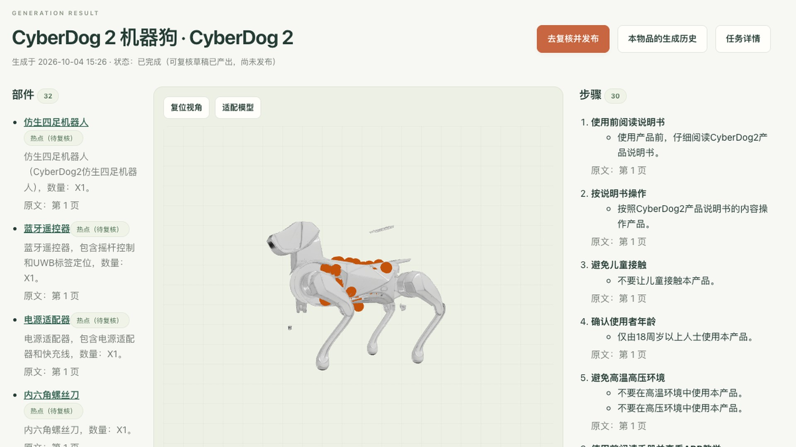

# Tripothon 公司内部作品提交 · 万物说明书

> 填写说明：以下内容按表单题号整理，可直接复制到「Tripothon公司内部作品提交」多维表格。
> 标 **【待填】** 的项需要提交人本人确认（姓名、部门、参评范围编码、对外展示授权等无法从代码仓库推断）。

---

## 1. 作品名称 \*

**万物说明书（Everything Manual）**——把产品说明书 PDF 变成可交互的 3D 说明书

## 2. 作品参评范围 \*

- [ ] 仅参加 Tripothon 内部评选
- [ ] 仅参加 Tripothon 外部评选
- [x] 内部 + 外部评选（建议）　官网作品编码：**【待填】**

> 若暂未在官网提交外部作品，请改选「仅参加 Tripothon 内部评选」。

## 3. Track / 赛道 \*

- [ ] 游戏
- [ ] 影视 / 视效
- [ ] VR / XR / AR
- [x] **应用**
- [ ] 实体设计

## 4. 团队名

**三启万物**　（留空则用负责人姓名）**【待确认】**

## 5. 内部团队成员 \*

**【待填：成员真实姓名】** 仓库提交记录中的贡献者账号：

- waultw
- lizhao
- qisanyijiu

## 6. 所属部门 \*

**【待填】** 如成员来自多个部门，请逐人注明，例如：`waultw — XX 部；lizhao — XX 部`

## 7. 作品封面 / 截图 \*

- 封面文件：[`docs/tripothon/cover.jpg`](cover.jpg)（1920×1080，16:9，JPG，约 0.2 MB）
- 内容：CyberDog 2 机器狗说明书自动生成的 3D 交互结果页——左侧部件列表、中间带自动热点的 3D 模型、右侧来自原文的步骤
- 更多截图（14 张，完整用户流程）：[`artifacts/user-walkthrough-cyberdog/`](../../artifacts/user-walkthrough-cyberdog/README.md)

## 8. 作品介绍 \*

**一句话**：上传一份产品说明书 PDF，几分钟后得到一个能旋转、能点部件、能「按下电源键」「让机器狗坐下」的 3D 交互说明书。

**解决的问题**：纸质 / PDF 说明书里「图 3 的编号 7」和实物对不上，按钮在哪、盖子怎么开、机器人有哪些姿势，要来回翻页对照。万物说明书把说明书里的文字知识和产品的 3D 模型绑在一起：点 3D 模型上的部件，就看到说明书里对应的说明和原文页码；跟着步骤走，模型就转到相关位置。

**用户流程**（完整 14 步截图见 `artifacts/user-walkthrough-cyberdog/`）：

1. 新建物品，上传说明书 PDF；
2. 系统自动从 PDF 拆出产品图，并用 AI 判断正面 / 侧面 / 背面，一键填好视图；
3. 确认报价和将发送给云端的资料后点「生成」，可以离开页面，完成后全局弹提示；
4. 后台并行完成：Tripo 多视图生成 3D 模型 → Tripo 分件 → 说明书 AI 逐批提取部件 / 步骤 / 规格（带原文页码出处）→ 自动热点绑定 → 自动推导交互动作和姿势；
5. 结果页直接预览 3D 模型、热点和交互（如相机「打开后盖」、扫地机「取出集尘盒」、咖啡机「取下滤碗手柄」、机器狗「站立 / 趴下 / 坐下 / 握手 / 作揖」）；
6. 复核页批量确认热点和文字事实，显式发布为不可变版本；
7. 发布版可在网页阅读，也可下载为单文件离线 3D 页面（three.js，双击即可打开）。

**已验证的说明书**（5 种品类并行跑通浏览器端到端测试，见 `artifacts/e2e-5-manuals/summary.md`）：

| 产品 | 自动热点 | 自动动作 | 自动姿势 |
|---|---|---|---|
| PENTAX 17 胶片相机 | 96 | 12 | – |
| 小米 CyberDog 2 机器狗 | 32 | 3 | 5 |
| 智云 SMOOTH 5S 手机云台 | 41 | 9 | – |
| 石头扫地机器人 S5（繁体说明书） | 28 | 9 | – |
| 德龙 EC685 咖啡机 | 15 | 3 | – |

**技术实现**：

- 前端 React 19 + TypeScript + React Three Fiber / three.js（GLB 运行资产、热点、刚体分件动画）；pdf.js 在浏览器内拆图与逐页制作页图；
- 后端 Rust（Axum + Tokio + 内置 SQLite），发布时前端静态资源、服务端与数据库引擎合成**一个二进制**，用户数据放独立目录，自托管、单管理员；
- 供应商密钥只在服务端，前端不接触；付费请求先落库再发送，「结果未知」绝不自动重复付费，需管理员对账（防止重复扣 Tripo credits）；
- 生成完成 ≠ 发布：AI 产出一律是待复核草稿，人工确认后才发布为不可变版本，每个版本带原文出处与哈希 manifest。

**Demo 访问**：本作品为自托管应用，需本地运行（运行方式见仓库 `docs/operations.md`）。**【待填：如有在线 Demo / 演示视频链接请补充】**

## 9. 或直接上传作品 \*

**【待上传】** 建议上传以下其一（500 MB 以内）：

- 演示视频（MP4）：可按 `artifacts/user-walkthrough-cyberdog/` 的 14 个步骤录屏；
- 或 ZIP：`artifacts/user-walkthrough-cyberdog/`（14 张流程截图）+ 一个发布版「离线 3D 页面」HTML（在阅读器点「下载离线 3D 页面」获得，单文件即可演示机器狗姿势交互）。

## 10. 工程源文件

本作品为软件项目，没有 Blender / Unreal 等工程文件；全部源代码、设计文档与测试见代码仓库（第 11 项）。技术方案与决策记录：仓库 `llmdoc/`。

## 11. 代码仓库

- 主仓库：https://github.com/qisanyijiu/everything-manual （分支 `feat/standalone-3d-viewer`）
- Fork：https://github.com/waultw/everything-manual

## 12. Tripo 的贡献 \*

Tripo 是作品的 3D 核心，三处直接调用 Tripo API（服务端 Rust 直接请求，密钥不出服务端）：

1. **多视图生成 3D 模型**：把从说明书 PDF 自动拆出的产品正 / 侧 / 背面线稿或照片，通过 Tripo 多视图生成任务（预设 `tripo-h-v3.1-standard`，PBR 贴图）生成带纹理的 GLB；单次生成约 30 credits；
2. **模型分件（mesh segmentation）**：调用 Tripo `mesh/segment` 把整体模型拆成独立部件节点（机器狗的四条腿、相机的后盖、扫地机的集尘盒……），这是所有「点部件」「打开盖子」「机器狗坐下」交互的基础；
3. **任务查询与结果下载**：轮询 Tripo 任务状态，从 Tripo CDN 下载生成结果并校验后入库；提交结果未知时支持「附加账户中查到的 Tripo 任务」对账，避免重复扣费。

在 Tripo 输出之上，作品自行完成：说明书知识提取（LLM）、部件与 3D 分件的自动热点绑定、基于分件包围盒的动作 / 姿势推导、发布与离线 3D 页面导出。

## 13. 是否允许公司官方对外展示 \*

**【待确认】** 建议：允许

## 14. 第三方素材 / 版权说明 \*

- [x] **已使用**
- [ ] 未使用需要署名的第三方素材

说明：

- **开源依赖**：React、React Three Fiber、three.js、pdf.js（pdfjs-dist）、TanStack Query、React Router；Rust 端 Axum、Tokio、SQLx / SQLite 等，均为开源许可（MIT / Apache-2.0 等）；
- **生成式 AI 工具**：Tripo API（3D 生成与分件）；说明书 AI 使用公司 LLM 网关（gpt-5.5，OpenAI 兼容接口）做知识提取与视图判断；
- **测试 / 演示用说明书**：展示与测试所用产品说明书 PDF 均为厂商公开发布的用户手册，仅用于功能演示，版权归原厂商所有——PENTAX 17（RICOH IMAGING）、CyberDog 2（小米）、SMOOTH 5S（智云 ZHIYUN）、石头扫地机器人 S5（Roborock）、EC685（De'Longhi）。封面与截图中的 3D 模型由 Tripo 根据这些说明书插图生成。对外展示时如需规避第三方品牌，可只使用自制物品的演示数据。**【待确认是否接受该用法】**
- 界面插画、图标为项目自制；未使用需要另行授权的图片、音频、字体素材。

## 15. 权利确认 \*

以下 6 项需提交人本人在表单中勾选确认：

- [ ] 我确认本次提交所填信息真实准确
- [ ] 我确认团队拥有或已获授权使用项目中的全部素材，未使用未经授权的图片、视频、音频、词作等媒体内容
- [ ] 我确认所有团队成员与贡献者均已列出
- [ ] 我同意 Tripothon S1 官方规则与行为准则
- [ ] 我同意授予 Tripo AI 免费、非独占的使用许可，可为本次活动及 Tripo AI 平台相关宣传推广之目的展示、传播和使用本作品；Tripo AI 将尽合理努力保留作者 ID 等来源信息，作品知识产权仍归创作者
- [ ] 我确认作品不含违反法律法规、消费苦难及特殊人群、挑动对立等违反公序良俗的内容

---

*表单来源：Tripothon 公司内部作品提交（三启万物多维表格 提供技术支持）。*
