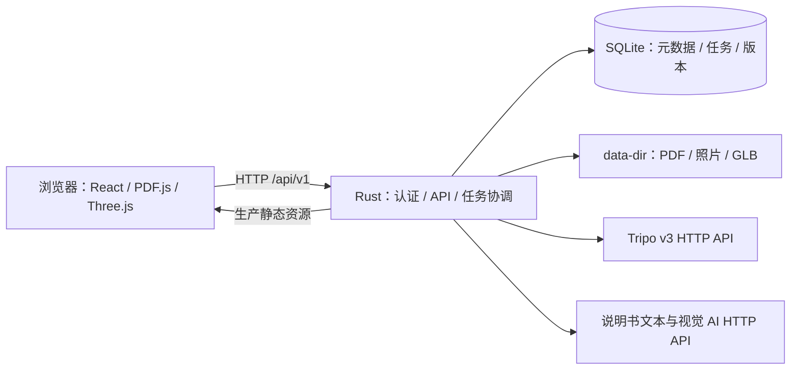

# 技术架构：React + Rust 单二进制网站

版本：1.0 · 2026-09-11 · 状态：设计基线，尚未实现／联调。本文不是测试通过证明；编码前由 PM 写明细 PRD、UI 补齐交互，再按 [任务卡](implementation-plan.md) 实施。

## 1. 产品与交付边界

用户提供物品名称、品牌、准确型号、说明书 PDF 和多视图照片，系统生成 3D 模型、提取有来源的部件及操作知识，组装成可校准、可发布的交互说明书。新增物品不再要求写代码。

首版默认单管理员、自托管资料库；不是多租户 SaaS。开发时前后端分离，发布时合为一个可执行文件。浏览器访问网站，不是 Electron/Tauri 桌面壳，也不再使用 SwiftUI/SceneKit。

**单二进制的准确含义：**每种操作系统／CPU 架构各有一个可执行文件，内含 Rust 服务、React 构建产物、前端运行资源、数据库迁移及 SQLite 引擎。运行时另有可写 `data-dir` 保存数据库、原始文件和模型；浏览器、操作系统及系统信任根仍属于环境依赖。“一个文件”不意味着所有平台通用、用户数据写入程序本身或运行时完全不联网。

首版包含：资料库、新建向导、PDF 准备、费用确认、后台任务与恢复、GLB 浏览、部件／步骤／原文联动、人工热点校准、草稿发布、备份恢复。后续增强才做：自动热点候选、多用户、服务端无人值守 PDF 渲染、精准分件、爆炸图和机械运动。不能把外观 AI 模型当作机械结构真值。

## 2. 总体结构



- 开发：Vite `127.0.0.1:5173`，Rust `127.0.0.1:8080`；Vite 代理 `/api`，默认不开放宽泛 CORS。
- 生产：一个 Rust 进程监听 HTTP／HTTPS，同源提供 `/api/v1/*` 与 SPA；任务 worker 同进程，不依赖 Redis。
- 浏览器只持会话 cookie，不接触 Tripo／说明书 AI 密钥；全部外部 API 从 Rust 调用。
- 前后端只能通过公开 DTO／HTTP 合同耦合；Rust 不读取 React 内部状态，React 不接触 SQLite。
- 构建可以需要 Node、Rust、C 编译器与平台 SDK；运行不要求 Node、Python、PDFium、Tesseract、Chromium、外部数据库或容器。

## 3. 固定技术基线

下列是系列选择与核对日快照。T01 必须解析可用版本、实际编译并提交锁文件，不使用 `latest`，不把下表误作已通过的组合测试。

| 层 | 选型 | 落地要求 |
| --- | --- | --- |
| 前端 | React 19、TypeScript strict、Vite | React 与 react-dom 同补丁；单独 `tsc --noEmit`，不能只跑构建 |
| 路由与请求 | React Router 声明式路由、TanStack Query、原生 fetch 封装 | 服务端状态在 Query；局部视图状态放组件；首版不用 Redux |
| 3D | Three.js、React Three Fiber 9、GLTFLoader、OrbitControls | 固定版本，3D 模块懒加载；React 19 对应 R3F 9 |
| PDF | pdfjs-dist | 主包、worker、字体、CMaps、WASM 等所需资源同版本、本地构建内嵌 |
| Web 服务 | Axum 0.8 系列、Tokio 1、tower-http 0.7 系列 | 短请求与后台工作分开；阻塞解析放有界 spawn_blocking |
| 数据 | SQLx 0.9 系列、bundled SQLite | 启用 sqlite/runtime-tokio/migrate/macros；该 SQLx 系列要求 Rust 至少 1.94 |
| 外部 HTTP | reqwest 0.13 系列、rustls | 禁用默认 features，启用 json/multipart/stream/rustls；不是旧版 rustls-tls feature 名 |
| 内嵌资源 | rust-embed 8、SQLx migrations | 仅 release 的 embedded-ui feature 要求 dist；不在 build.rs 中运行 npm／联网 |
| 机器合同 | Rust DTO + utoipa 5 → OpenAPI 3.1 → openapi-typescript | 禁止前端手抄 API 类型；CI 检测生成文件漂移 |
| 测试 | Rust 单元／集成、Vitest、React Testing Library、Playwright | fixture 默认；真实收费验证另设授权入口 |
| 工程工具 | Cargo workspace + xtask、npm lockfile | 不引入 Turborepo、微服务、消息中间件 |

依据：[R3F 兼容说明](https://r3f.docs.pmnd.rs/)、[Vite TypeScript](https://vite.dev/guide/features#typescript)、[SQLx 变更与 MSRV](https://github.com/transact-rs/sqlx/blob/main/CHANGELOG.md)、[reqwest TLS](https://docs.rs/reqwest/latest/reqwest/tls/)、[utoipa](https://docs.rs/utoipa/latest/utoipa/)。

## 4. 目录和模块边界

以下均为待创建的代码结构，不表示文件已经存在。

```text
apps/web/                    React SPA；npm 项目
  src/api/                   generated.ts + HTTP/error 封装
  src/features/              library / import / jobs / manual / viewer / settings
  src/components/            共享基础组件
  public/vendor/             PDF.js 等需静态复制的同版本资源
crates/core/                 package manual-core：领域类型、校验、状态转换
crates/server/               package everything-manual：二进制与可测试 library
  src/http/                  路由、DTO、认证、错误映射
  src/storage/               SQLx repositories、迁移、blob 存储
  src/jobs/                  调度、租约、阶段 DAG、恢复
  src/providers/             tripo / manual_ai；业务不直接拼 URL
  src/assets/                上传、GLB 检查、Range 服务
  src/config/                配置、CLI、日志脱敏
  tests/                     命名集成测试目标
crates/test-support/         仅 dev-dependency：本地 HTTP fixture、样例数据
xtask/                      构建、合同导出、校验、打包、smoke
migrations/                 只追加 SQL；随二进制内嵌
contracts/openapi.json       从 Rust 生成、提交版本控制
tests/fixtures/             合法小型 PDF/GLB/图片与脱敏响应
tests/e2e/                  浏览器验收
llmdoc/                     为什么这样做、合同解释、任务、决策、交接
artifacts/                  测试日志／截图／发布报告，不存密钥
```

依赖方向：server → core；web → 生成 HTTP 类型；test-support 只能作为测试依赖；core 不依赖 Axum、SQLx 或浏览器。路由负责 DTO／认证，服务层负责用例，repository 负责持久化，Provider 负责供应商格式转换。避免把整个业务写进 handler 或 React 单组件。

## 5. 资料到交互说明书的流程

1. 创建物品草稿并上传原始 PDF、照片；用户明确照片视图和型号。文件先落本地，尚不调用收费服务。
2. 浏览器使用 PDF.js 顺序提取页文字和页图，上传到 preparation；完成全部页的服务端校验后准备状态才是 ready。
3. 用户查看资料清单、发送到云端的内容、模型版本和预算；显式点击生成。Rust 冻结输入快照、预留费用、幂等创建本地任务。
4. Rust 可并行进行说明书 AI 提取和 Tripo 模型生成；远端任务 ID 与每个阶段落库。浏览器关闭不影响已提交后台任务，前提是服务进程仍运行。
5. Rust 下载 GLB、检查资产，保存有页码依据的部件和步骤，生成 `needs_review` 草稿。生成成功不代表事实已核验。
6. 用户在浏览器查看模型、确认内容、点选表面绑定热点、设置步骤视角。必要时修正文案并保留修改来源。
7. 服务端验证发布条件，生成不可变说明书版本。阅读端展示 3D、部件、步骤、原文；外部 AI 不可用时仍能读取已有本地内容。

### 5.1 PDF 准备为何放在浏览器

服务器直接渲染任意 PDF 通常需要额外原生库或程序；首版用 PDF.js 保住运行时单二进制边界。代价是初次准备需要页面保持打开。未完成准备时关闭标签页，不能声称服务器会自行补齐扫描页；重新进入后从服务器取原 PDF，只补缺页。

实现约束：原 PDF ≤50 MiB、≤100 页；加密 PDF 首版明确拒绝。每次只渲染一页，长边最多 2000 px、白底 JPEG；先提取文本，保留页级出处，不能用不正确的 transform 直接伪造字符框。旋转后 viewport 的左上角作为页图坐标原点。PDF 主线程包和 worker 版本必须匹配，所需 CMaps、standard fonts、WASM 等不访问 CDN。切换／取消时销毁 render task 和 canvas；传入 worker 的 ArrayBuffer 可能被转移，不可继续假设其可读，应保留原 File 或重新读取。

`preparation.complete` 只封存资料，不自动发起收费任务。服务端验证页号连续、所有资产已提交、哈希和归属正确。哈希只能证明字节一致，不能证明客户端页图确实来自原 PDF；首版作为已认证用户提供的派生资料，标记 `clientDerived`，保存原件供复核。

这些 PDF.js 约束依据 [官方 FAQ](https://github.com/mozilla/pdf.js/wiki/Frequently-Asked-Questions) 与 [API](https://mozilla.github.io/pdf.js/api/draft/api.js.html)；2000 px／100 页等限制是本项目初始预算，QA 实测后可通过决策修订。

### 5.2 说明书 AI

Tripo 不负责读懂说明书。单独定义 `ManualAiProvider`，输入页文字、必要页图、型号与输出 schema；输出部件、步骤、规格和证据引用。首版参考适配器采用 OpenAI Responses HTTP，模型名由服务端配置为支持图像与 Structured Outputs 的型号，不自动跟随“最新模型”。Rust 直接 HTTP，不要求 Python／Node SDK。

按最多 5 页／文本上限分批，记录批次覆盖率，聚合阶段去重但不能删除原始出处；每项事实必须引用输入中真实存在的 document/preparation/page。扫描页文字为空时发送页图给视觉模型；不装本地 OCR 可执行文件。不支持的型号、拒答、截断、无证据结论进入待复核，不用正则“抢救”畸形 JSON 后当真。

请求使用 Responses 的 `text.format` JSON Schema，不误用 Chat Completions 的 `response_format`；图像可使用 `input_image` 的 JPEG data URL。解析 REST `output[].content[]` 中的 `output_text`，另行处理 refusal、incomplete 与失败，不依赖 SDK 才有的便利字段。设计依据：[Structured Outputs](https://developers.openai.com/api/docs/guides/structured-outputs)、[图像输入](https://developers.openai.com/api/docs/guides/images-vision)。

资料是待分析数据，不是可信指令。模型无工具执行权限，不能按 PDF 内文字更改预算、访问任意 URL 或运行命令。云端发送前展示告知；API key 不进前端，输出不包含密钥；提示词、schema、模型、价格版本和覆盖页集合都随任务快照保存。

### 5.3 Tripo 适配器

首版使用 v3，全球基础地址 `https://openapi.tripo3d.ai/v3`；区域地址由部署配置和账号区域决定。流程为上传图片取得 token → 多视图生成 → 持久化 task_id → 查询 → 下载结果。不要混入旧 v2 的 `model_version`／`files` 请求格式。

默认 H 系列 `v3.1-20260211`，贴图和 PBR 开启，standard 质量，`face_limit=100000`，不启用 quad、分件或压缩。多视图至少正面加另一视图，输入视图为 front/left/back/right；缺照片要求用户补齐，不偷偷用 AI 造图代替实物照片。首版只接受 JPEG／PNG 上传，避免不同接口支持格式差异。依据：[文件上传](https://developers.tripo3d.ai/en/docs/files)、[多视图生成](https://developers.tripo3d.ai/en/docs/generation-multiview-to-model/standard)。

任务结果取 `output.model_url`，成功后立即保存本地，不把临时供应商 URL 当永久模型地址。未知远端状态保留原值并进入待处理；查询失败不能等同生成失败。依据：[任务查询](https://developers.tripo3d.ai/en/docs/task-query)、[生命周期](https://developers.tripo3d.ai/en/docs/task-lifecycle)。

2026-09-11 价格快照：上述标准带纹理 H 模型基价 30 credits，1 credit = USD 0.01，即约 USD 0.30；不包括说明书 AI、重试或其他处理。网页直接用 GLB，不再默认加 USDZ 转换费用。最终按供应商返回和价格配置核算，不保证视觉不满意可退款。依据：[价格](https://developers.tripo3d.ai/en/pricing)、[计费](https://developers.tripo3d.ai/en/docs/billing)。

### 5.4 3D 和热点

首版支持 glTF 2.0 二进制 GLB，自包含 BIN 与 PNG/JPEG 贴图；拒绝外链 buffer/image URI，拒绝未支持的 required extension。模型只作为资料资产，不执行脚本。若真实 Tripo 输出要求新解码器，先增加 fixture 和决策，再将解码器本地内嵌；不能现场依赖 CDN。

资产版本不可变。热点记录 `modelRevisionId + modelSha256 + asset-root 局部坐标`，不使用运行时 mesh.uuid 或易变名称作唯一锚点。显示居中／缩放放在外层 group，保存位置时用 asset-root 的 `worldToLocal`；读取时应用相同变换。raycast 只包含模型 mesh，排除热点自身；拖动旋转后不能误触创建热点。法线若保存，必须正确处理非均匀缩放，不能当普通方向向量变换。

重新生成模型创建新 revision；旧发布版继续指向旧模型，新草稿的旧绑定标记 stale，不能静默复用。部件名字不等于一个可独立移动的 mesh；首版高亮热点而不谎称已正确分件。依据：[glTF 规范](https://registry.khronos.org/glTF/specs/2.0/glTF-2.0.html)、[GLTFLoader](https://threejs.org/docs/pages/GLTFLoader.html)、[Raycaster](https://threejs.org/docs/pages/Raycaster.html)。

首版交互：旋转／缩放／复位、点击热点、部件列表定位、步骤导航、查看原文。3D 失败仍可读文字和 PDF；处理 WebGL context lost/restored、错误边界与重建，不只提供一个刷新按钮。候选自动绑定作为后续阶段：浏览器渲染精确模型版本的多视图 → AI 返回 2D 候选 → 相同相机矩阵 raycast → 人工确认。它需要浏览器参与，不承诺浏览器关闭时可继续这一阶段。

## 6. 后台、存储与可靠性

SQLite 是任务事实来源；Tokio channel 只唤醒，不当队列数据库。一个 data-dir 只允许一个进程持有排他锁。连接启用 foreign_keys、WAL、busy_timeout=5s，首版 synchronous=FULL；连接池上限 4，事务短小，不跨 HTTP 请求持有事务。WAL 要求本地文件系统，首版不支持 NFS／共享盘多实例。依据：[SQLite WAL](https://www.sqlite.org/wal.html)。

任务按阶段落库，带 `leaseOwner/leaseEpoch/leaseUntil/nextRunAt`；默认租约 120 秒、20 秒续约；SQL 条件更新领取，状态推进校验租约 epoch，过期 worker 不得覆盖新结果。文件散列／GLB 解析走有界阻塞线程池；全局远端生成并发 2、说明书批次并发 2，均可降低。

付费 POST 的“服务器收到但客户端没拿到任务 ID”无法靠本地事务实现 exactly-once。预先保存 attempt；网络或崩溃使结果未知时标记 `submission_unknown`，禁止自动再次购买。GET 查询可指数退避；自动重试上限、退避、费用预留详见 [合同](contracts.md)。进程恢复优先查已知远端 ID，绝不一律重新生成。

data-dir：`manual.sqlite3`、SQLite WAL/SHM、`blobs/<sha256前缀>/<sha256>`、`tmp/`、`logs/`、锁文件。上传流写 tmp，校验／fsync／原子 rename 后短事务提交 blob 元数据；崩溃留下的文件按引用扫描隔离／清理，不能因为数据库回滚就删除已有共享 blob。原文件名仅作元数据，不参与路径拼接。

## 7. 运行安全与单文件发布

默认 `127.0.0.1:8080`，必须初始化管理员，不提供默认密码。密码交互输入或从受限文件读取；Argon2 哈希。会话 HttpOnly、SameSite=Strict，HTTPS 下 Secure；CSRF token 和 Origin 检查覆盖所有修改请求，包括 multipart。登录限速，会话可注销。外网／局域网部署必须认证和 TLS，可用内置 rustls 证书文件或明确受信任的反向代理；不能默认相信任意 X-Forwarded-*。

首版不支持“服务端抓取任意用户 URL”，用户上传本地文件，来源链接仅保存作引用。供应商下载也需 HTTPS、允许域配置、DNS／每次重定向的地址校验、大小／超时上限，拒绝私网／回环／链路本地地址，不能把 bearer token 转发到模型 CDN。关闭自动重定向，应用逐跳验证，将实际连接 pin 到验证过的 IP 并保留原 HTTPS hostname/SNI，避免预检后再次解析造成 DNS 重绑定漏洞。测试本机 fixture 仅测试配置显式允许。

所有用户资产经授权路由服务，不把 data-dir 整目录暴露。静态资源与 API 路由分离：未知 `/api/*` 必须 JSON 404，不能返回 index.html；SPA fallback 仅 HTML 导航。哈希静态资源长缓存，index 不长期缓存；PDF／GLB 支持 HEAD、单 Range、ETag，不对 Range 响应动态压缩。密钥、原始 PDF 内容、签名 URL 查询串不进日志。

发布路径：`npm ci → typecheck/test/build → Rust --features embedded-ui --release → smoke → 按目标打包`。最终包中只需可执行文件及可选 README／校验和／许可证清单。内嵌迁移的 build.rs 声明 rerun-if-changed，避免 SQL 改了却未更新二进制，见 [SQLx migrate](https://docs.rs/sqlx/latest/sqlx/macro.migrate.html)。

启动自动检测 schema 兼容并迁移；拒绝打开比程序更新的 schema。备份首版采用停止服务并获取独占锁后的快照，连同被引用 blob；不得只复制运行中 WAL 数据库的主文件。恢复到新空目录后校验引用与哈希再使用。升级前备份，回滚程序不等于回滚数据库。发布平台和冷启动验收见 [发布规范](validation-release.md)。

## 8. 可观测性与已知限制

结构化日志包括 requestId/jobId/stage/attemptId、耗时与错误码；管理页显示 provider 配置是否存在而不返回密钥。任务页面区分本地准备、排队、供应商进度、等待人工、失败与发布，不用虚假线性百分比。健康检查分存活与就绪，供应商断网不应使已有说明书不可读。

没有资料质量、真实 API 兼容、费用和 GPU 性能证据时，不称“全自动准确”或“已生产可用”。真实收费验证需要用户授权；该缺口必须写入 QA 的 BLOCKED／未验项。后续 SaaS、多进程、后台 PDF 渲染、真实机械运动均须新 PRD／决策，不由 RD 顺手扩展。
