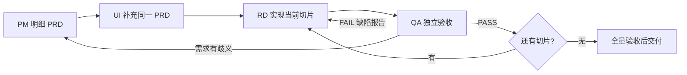

# PM / UI / RD / QA 协作流程

## 1. 启动与职责

在仓库根目录启动 Claude Code，输入 `/team web-mvp`，或 `/team <新需求描述>`。项目定义四个 subagents，主会话是协调者。配置采用 `.claude/agents/*.md` 与 `.claude/commands/team.md`；本次主会话最终执行 `claude --version` 返回 2.1.236，配置已静态检查，尚未执行完整模型协作。四角色继承主模型，不强制指定昂贵模型，不配置跳过权限。

Claude Code 支持项目级子 agent Markdown 配置；本项目使用主会话串联，避免依赖不同版本对嵌套委派的支持。命令目录仍被官方支持。配置是工作流指令和工具集合约束，不是独立的操作系统路径沙箱或常驻调度服务。[官方 subagents](https://code.claude.com/docs/en/sub-agents)、[官方命令／skills](https://code.claude.com/docs/en/skills)



| 角色 | 主要输入 | 写入范围 | 完成结果 |
| --- | --- | --- | --- |
| PM | request、技术约束、现状 | 当前 PRD 的产品内容、产品决策 | PM_READY |
| UI | PM_READY PRD、合同 | 同一 PRD 的 UI 章节、必要设计附件 | UI_READY 或 NEEDS_PM |
| RD | UI_READY PRD、任务卡、QA 缺陷 | 实现、测试、构建、implementation、技术决策 | RD_READY |
| QA | PRD、RD 交付、真实测试环境 | qa-report、验收测试、验收知识 | PASS / FAIL / BLOCKED |
| 主协调会话 | 各角色结果 | request、state、交接与任务调度 | 阶段推进或具体阻塞 |

## 2. 工作目录与状态

每个需求用 `llmdoc/requirements/<work-id>/`。PM 首次开工创建 `prd.md`，UI 在同一文件增补交互。RD 创建 `implementation.md`，QA 创建 `qa-report.md`。模板不能被当作完成文档。

state 的合法 phase：`pm_pending`、`pm_ready`、`ui_ready`、`rd_running`、`qa_running`、`rd_fixing`、`blocked`、`done`。

主会话是 state 唯一写入者；每次包含 work_id、需求版本、PRD 修订号、UI 对应修订号、当前切片、已验收切片、QA 回合、未关闭缺陷、阻塞原因和 next_action。角色不得同时改 state。

阶段门禁：

- `pm_pending → pm_ready`：PRD 有真实内容、REQ/AC、边界、异常、非功能要求；开放问题明确。
- `pm_ready → ui_ready`：UI 已补同一 PRD，每个交互需求有 UI/AC 映射；冻结该修订号。
- `ui_ready → rd_running`：当前切片所有依赖已验收，给 RD 具体范围；只派发一个生产代码写入者。
- `rd_running/rd_fixing → qa_running`：RD 交付文件、实际测试、AC 映射和 llmdoc 摘要齐全。
- `qa_running → rd_fixing`：QA FAIL，缺陷结构完整，交给 RD；QA 缺环境则 blocked，不能伪造缺陷修复。
- 当前切片 PASS：加入 accepted_tasks，进入下一切片；全部切片完成后进行独立全量验收。
- `qa_running → done`：全量必选 AC 和 release gate 通过，未关闭验收缺陷为 0，非代码知识已记录。

恢复时按 phase 精确派发：pm_pending→PM，pm_ready→UI，ui_ready/rd_running→RD，rd_fixing→RD 修当前缺陷，qa_running→QA。done 只报告已有结果，不自动重开。UI 的 NEEDS_PM 或 RD 的 NEEDS_PRD_CHANGE 均退回 pm_pending，保留当前任务和缺陷；修订后重新经 UI，再继续受影响切片。

进入 blocked 前保存 `resume_phase`、`blocked_on`（user_choice/permission/credential/environment/provider）和具体 `unblock_condition`。解除后回原阶段，不从头开始；恢复后清空阻塞字段。工具失败本身不等于需用户介入，应先做安全、在范围内的检查。

`accepted_tasks` 条目固定为 `{task_id, prd_revision, qa_round, report, accepted_ac_ids, status}`，status 为 accepted 或 needs_retest。`qa_history` 每轮追加 `{round, scope, task_ids, prd_revision, result, report}`。报告路径可相同，但报告内必须保留回合标题。进入新切片、RD 修复或 PRD 修订时将当前 qa_result 置 null；受影响旧条目标记 needs_retest。未受影响项可由 QA 记录复核依据后绑定新修订号，不是直接复制 PASS。done 必须查 qa_history 中当前 PRD 修订的 scope=full PASS，不能只判断一个字符串。

修复循环不设“重试三次就算通过”。反复失败时要求 RD 缩小复现并提供新证据；真正需要用户选择或外部条件时记录 blocked 和恢复入口。

## 3. 派发包（每次必须提供）

```text
角色 / work-id / 当前阶段与回合
用户目标和本次有限范围
request 路径 / PRD 路径与修订号
必读 llmdoc 和依赖完成证据
task IDs / REQ IDs / AC IDs / UI IDs
允许修改文件和明确非目标
必须执行的验证及输出文件
已有缺陷报告和需要修复的 defect IDs
交接格式；不得替其他角色签发完成
```

不要只传“继续做”“修一下”；角色恢复也应读磁盘上的最新 PRD 和报告，不仅依赖上次聊天。

## 4. 需求变更与验收争议

需求变更由 PM 在 PRD 追加变更记录并增加修订号，UI 更新受影响设计，RD 标明需重做任务，QA 重开受影响 AC。没有受到影响的已验收项可保留，但必须注明依据。修代码不能顺手改验收阈值来掩盖问题。

QA 问题含 `BUG-xxx`、严重度 P0/P1/P2/P3、AC/UI、复现、期望、实际、证据。所有违反当前必选验收项的问题均阻断当前切片 PASS；改进建议列在独立非阻断建议中，不混作已接受需求。

RD 对 bug 记录“已修复，待复验”；只有 QA 将其 CLOSED。产品解释争议回 PM，交互歧义由 UI 补充；主会话随后重派 RD/QA。

## 5. 四角色共同的 llmdoc 约定

开工前读取索引和相关重点；结束前补足代码无法体现的信息。PM 记录业务原因，UI 记录交互意图，RD 记录架构及外部约束，QA 记录验收依据和未覆盖边界。所有记录都带状态、日期、证据和影响，能链接代码／测试时提供链接。

文档初稿的结论标 `planned`；经真实编译、接口或 QA 验证后才标 `verified`。记录新增、变更、废弃分别注明，不把“目前不知道”写成“已支持”。

## 6. 权限与完成范围

已授权需求按上述门禁持续执行；门禁是产物检查，不是要求用户每阶段手工批准。仓库配置本身不授权付费 API、公网发布、远端推送或破坏性操作。真实生成验收须有明确预算；缺少时准确报告该项待验证。

本轮仅创建方案与协作配置，不启动 web-mvp 全量编码。`/team web-mvp` 后才由 PM 产出首份明细 PRD。如果当前会话未加载新角色，重新打开项目 Claude Code；不使用 `claude --agent pm` 启动完整流水线，因为 PM 是专业角色，不是协调入口。
